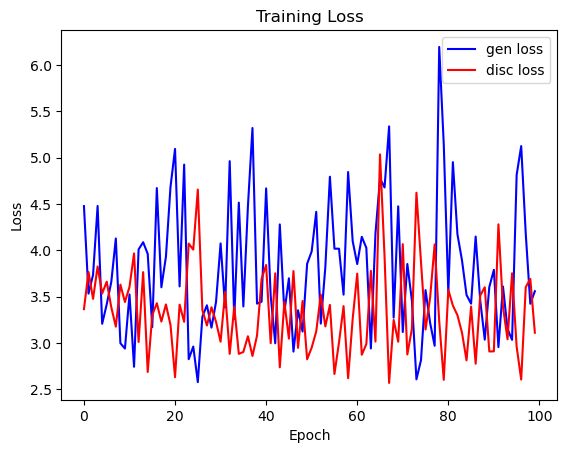
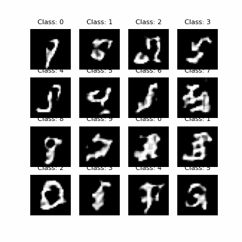

**Overview**

This project focuses on exploring the Auxiliary Classifier Generative Adversarial Network (AC-GAN), a variant of the General Adversarial Network (GAN), in the context of class-specific image generation. AC-GAN introduces an additional auxiliary classifier that conditions the generated images on specific class labels, making it highly effective for generating images with distinct class attributes.

In this implementation, I have trained the AC-GAN model on the MNIST dataset, which consists of grayscale images of handwritten digits ranging from 0 to 9. The objective was to generate realistic images of handwritten digits while conditioning the model to produce images of a specified class (i.e., digits 0 through 9).

Key aspects of this project include:

* Model Architecture: The AC-GAN consists of both a generator and a discriminator. The generator produces images conditioned on class labels, while the discriminator is responsible for distinguishing between real and generated images, as well as predicting the correct class of the images.
* Training Process: The model was trained using the MNIST dataset, leveraging adversarial loss for distinguishing real from fake images and a classification loss for class prediction.
* Results: After training, the AC-GAN was able to generate realistic, high-quality images for all the digits in the MNIST dataset. However, the model was unable to accurately match the designated classes.

Below shows the loss during the training process.

As mentioned in the ACGAN paper, the training process was unstable.

**Next Steps**
* Add more weighting to the class specifc loss. 
